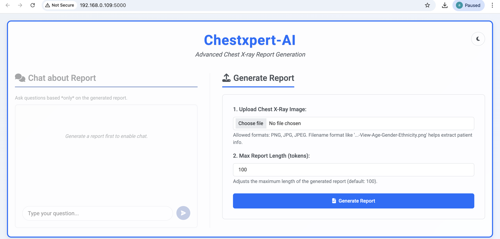
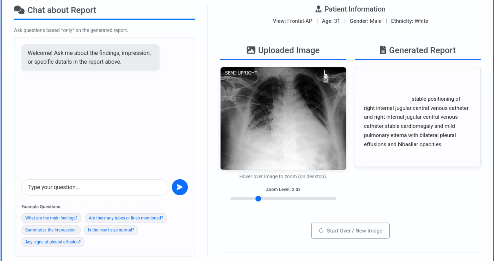
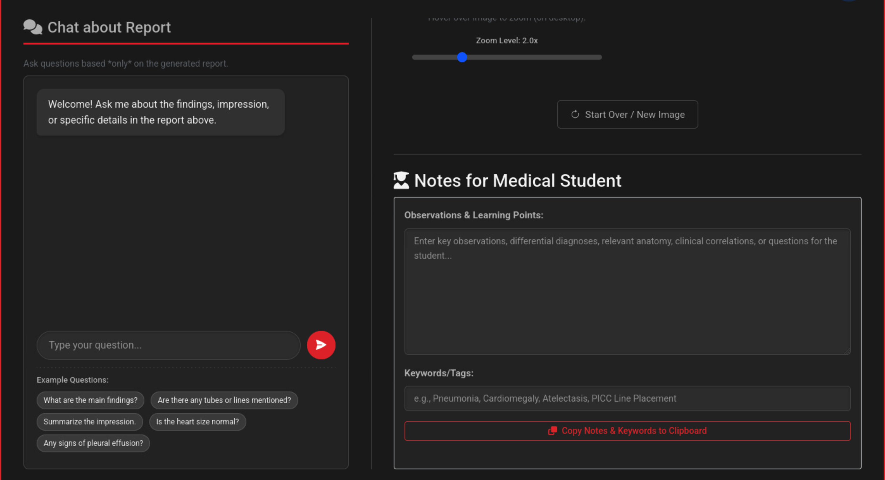

# 🩻 ChestXpert-AI

> **End-to-End Chest X-ray Report Generation & Clinical Chatbot System**
> *Vision-Language AI + Medical NLP*

---

## User Interface: Light Mode


## User Interface: Dark Mode


## Generated Report


## Notes For Medical Students


## Zoom Functionality


## 🌟 Overview

**ChestXpert-AI** is an end-to-end AI-powered application that automatically generates **radiology-style chest X-ray reports** and provides an **interactive medical chatbot** for clinical question answering.

The system combines:

* **Vision-Language Models (VLMs)** for image-to-text report generation
* **Large Language Models (LLMs)** for conversational medical reasoning
* A **full-stack web application** for real-time interaction

This project is designed for **research, learning, and portfolio demonstration** purposes.

---

## ⚠️ Important Limitations & Disclaimers

### Medical Disclaimer
**This application is NOT for clinical use.** The AI-generated reports and chatbot responses are:
- For **educational and research purposes only**
- **Not a substitute for professional medical diagnosis**
- Should **never be used for actual patient care decisions**

### Model Limitations
The current model has several known limitations:

1. **Template-based Training**: The model was trained on synthetic reports generated from disease templates, not real radiologist reports
2. **Limited Accuracy**: May produce generic or incorrect findings for complex cases
3. **No Clinical Validation**: Model outputs have not been clinically validated
4. **Dataset Bias**: Trained on NIH dataset which may not represent all demographics or conditions
5. **Generation Quality**: May produce repetitive or medically implausible text

### Recommendations
- Always consult qualified radiologists and physicians for medical interpretations
- Use this tool only for learning AI capabilities in healthcare
- Consider model outputs as supplementary information, not definitive diagnoses

---

## ✨ Key Features

* 🩻 Automated chest X-ray report generation
* 🤖 Medical chatbot for report-based Q&A
* 📊 Evaluated using BLEU, ROUGE, and METEOR metrics
* 📦 Trained on a large-scale real-world medical dataset (45GB)
* 🌐 End-to-end deployment-ready architecture

---

## 🧠 Models Used

### 1️⃣ Vision-Language Model (Report Generator)

* **Architecture:** BLIP (Bootstrapped Language-Image Pretraining)
* **Task:** Image → Radiology-style medical report
* **Fine-tuned on:** NIH Chest X-ray Dataset

🔗 **Trained Model (Hugging Face):**
[https://huggingface.co/anassaifi8912/chestxray-blip-report-generator](https://huggingface.co/anassaifi8912/chestxray-blip-report-generator)

```python
from transformers import BlipProcessor, BlipForConditionalGeneration

processor = BlipProcessor.from_pretrained("anassaifi8912/chestxray-blip-report-generator")
model = BlipForConditionalGeneration.from_pretrained("anassaifi8912/chestxray-blip-report-generator")
```

---


### 2️⃣ Chatbot Model (Clinical Q&A)

* **Model:** Qwen (Large Language Model)
* **Role:**

  * Answer questions based on generated X-ray reports
  * Provide contextual explanations of findings
  * Support conversational medical queries

The chatbot is integrated with the generated report to ensure **context-aware responses**.

## Chatbot


---

## 📊 Dataset

### NIH Chest X-ray Dataset (ChestX-ray14)

* **Total Size:** ~45 GB
* **Images:** 112,000+ chest X-rays
* **Labels:** 14 thoracic disease classes

🔗 **Dataset Link (Kaggle):**
[https://www.kaggle.com/datasets/nih-chest-xrays/data](https://www.kaggle.com/datasets/nih-chest-xrays/data)

⚠️ *Dataset is not included in this repository due to size constraints.*

---

## 🏗️ Project Architecture

```
User Uploads X-ray
        │
        ▼
BLIP Vision-Language Model
        │
        ▼
Generated Medical Report
        │
        ├──► Displayed in Web UI
        │
        └──► Passed to Qwen Chatbot
                     │
                     ▼
          Context-Aware Medical Responses
```

---

---

## 🚀 Installation & Usage

```bash
# Clone repository
git clone https://github.com/anassaifi775/ChestXpert-AI.git
cd ChestXpert-AI

# Install dependencies
pip install -r requirements.txt

# Run application
python app.py
```

---

## 📈 Evaluation Metrics

The report generation model is evaluated using:

* **BLEU** – Measures n-gram overlap
* **ROUGE** – Measures recall-based similarity
* **METEOR** – Considers semantic similarity

Evaluation notebooks are provided in the `notebooks/` directory.

---

---

## ⚠️ Disclaimer

This project is intended **strictly for research and educational purposes**.

* ❌ Not approved for clinical use
* ❌ Not a replacement for professional medical diagnosis

Always consult qualified healthcare professionals for medical decisions.

---

## 👤 Author

**Anas Saifi**

Data Science | Machine Learning 

---

## ⭐ Acknowledgements

* NIH Clinical Center
* Kaggle Datasets
* Hugging Face Transformers
* Qwen LLM Team

---

## 🌟 Support

If you find this project useful:

* ⭐ Star the repository
* 🍴 Fork it
* 🐛 Open issues or contribute

Your support motivates further development!
