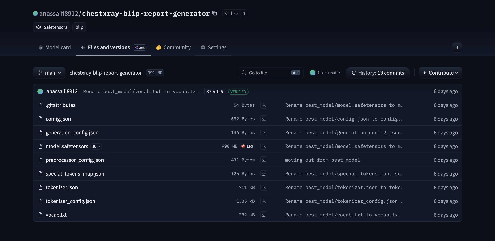

# 🤖 ChestXpert-AI — Chest X-ray Report Generator

This directory contains the **fine-tuned Vision-Language model** used in the **ChestXpert-AI** project for automatic chest X-ray report generation.

---

## 🧠 Model Overview

- **Task**: Chest X-ray → Radiology Report Generation  
- **Architecture**: Vision-Language Model (BLIP-based)  
- **Framework**: PyTorch + Hugging Face Transformers  
- **Training Data**: NIH ChestX-ray14 (45GB)  
- **Epochs**: 3  
- **Precision**: FP16 supported  

---

## Model 



## 🧬 Model Architecture

Chest X-ray Image
↓
Vision Encoder (ViT / BLIP)
↓
Cross-modal Attention
↓
Text Decoder
↓
Radiology-style Report


---

## 📦 Model Files

best_model/
├── config.json
├── model.safetensors
├── generation_config.json
├── preprocessor_config.json
├── tokenizer.json
├── tokenizer_config.json
├── vocab.txt
├── special_tokens_map.json


---

## 📥 Model Access

The trained model is hosted on **Hugging Face**:

🔗 **Model Repository**:  
https://huggingface.co/anassaifi8912/chestxray-blip-report-generator

---

## 🚀 How to Load the Model

```python
from transformers import BlipProcessor, BlipForConditionalGeneration

processor = BlipProcessor.from_pretrained(
    "anassaifi8912/chestxray-blip-report-generator"
)

model = BlipForConditionalGeneration.from_pretrained(
    "anassaifi8912/chestxray-blip-report-generator"
)

