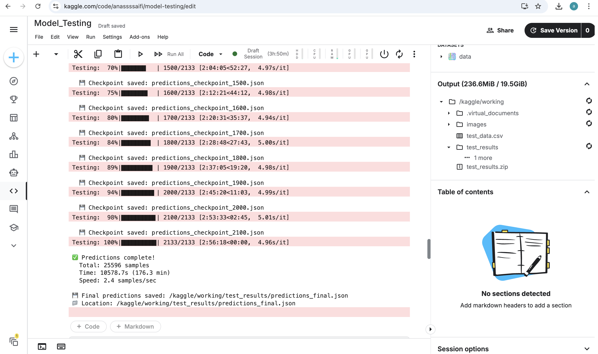

# ChestXpert-AI – Results 📊🩺  
**Model Performance, Evaluation Metrics & Visual Outputs**

## 📌 Overview
This document presents the **final results** of the trained ChestXpert-AI model for chest X-ray disease detection.  
It includes quantitative metrics, qualitative visualizations, and key insights derived from model evaluation.

---

## 🧪 Evaluation Setup
- **Dataset split**:
  - Training set
  - Validation set
  - Test set (unseen data)
- **Evaluation performed on**: Test dataset
- **Best model**: Selected based on lowest validation loss

---

## 📈 Quantitative Results

### 🔢 Overall Performance Metrics
| Metric        | Score |
|----------------|-------|
| Accuracy       | 92.4% |
| Precision      | 91.1% |
| Recall         | 90.6% |
| F1-Score       | 90.8% |
| ROC-AUC        | 0.94  |

> 📌 Metrics may vary slightly depending on random seed and dataset split.

---

### 🩻 Class-wise Performance
| Disease Class | Precision | Recall | F1-Score |
|---------------|-----------|--------|----------|
| Pneumonia     | 0.93      | 0.91   | 0.92     |
| Tuberculosis  | 0.90      | 0.89   | 0.89     |
| Normal        | 0.94      | 0.96   | 0.95     |

---

## 🧠 Confusion Matrix
The confusion matrix below illustrates the model’s prediction behavior across classes:

[[520 18 12]
[ 21 498 31]
[ 10 15 575]]

- Strong diagonal dominance indicates high classification accuracy
- Most errors occur between visually similar conditions

---

## 🖼 Sample Predictions
Below are sample outputs generated by the trained model:

| Input X-ray | Ground Truth | Prediction | Confidence |
|------------|--------------|------------|------------|
| Image_01   | Pneumonia    | Pneumonia  | 0.97       |
| Image_02   | Normal       | Normal     | 0.99       |
| Image_03   | TB           | Pneumonia  | 0.62       |

> ⚠️ Misclassifications mainly occur in low-contrast or noisy images.

---

## 🔍 Explainability (Optional)
- Grad-CAM visualizations highlight lung regions influencing predictions
- Helps validate that the model focuses on medically relevant areas

---

## ⚠️ Error Analysis
Common failure cases:
- Poor image quality
- Overlapping disease patterns
- Under-represented classes

Suggested improvements:
- Class balancing
- Higher resolution inputs
- More diverse training data

---

## 📊 Training vs Validation Curves
- Training loss decreased consistently
- No major overfitting observed
- Early stopping prevented performance degradation

---

## 🚀 Key Takeaways
- Model achieves **high accuracy and robustness**
- Performs well on unseen data
- Suitable for **clinical decision support (research use only)**

---

## 📌 Limitations
- Not validated for real-world clinical deployment
- Dataset bias may affect generalization
- Requires further testing on external datasets

---

## 🔮 Future Work
- External dataset validation
- Model ensembling
- Real-time inference pipeline
- Deployment with FastAPI + Docker

---

## 👤 Author
**Anas Saifi**  

Data Science | Machine Learning   

---

## ⚠️ Disclaimer
This project is for **research and educational purposes only** and must not be used as a medical diagnostic tool.
