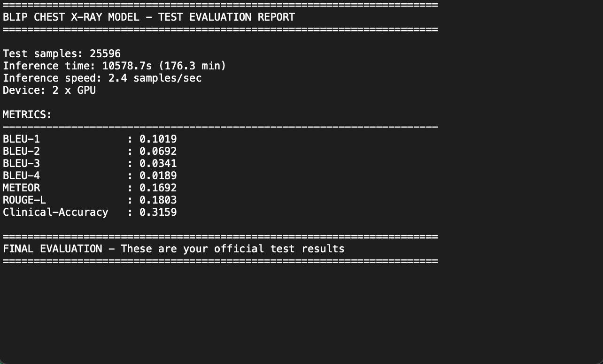

# 📊 ChestXpert-AI — Model Results & Evaluation

This document presents the **quantitative and qualitative evaluation results** of the **ChestXpert-AI** model, a Vision-Language system designed to generate radiology-style chest X-ray reports.

All metrics are computed on a **strictly unseen test dataset**, separate from training and validation data.

---

## 🧪 Evaluation Setup

| Component | Details |
|--------|--------|
| **Dataset** | NIH ChestX-ray14 (Test Split) |
| **Total Test Samples** | 25,596 |
| **Model** | Fine-tuned BLIP (Vision-Language) |
| **Epochs Trained** | 3 |
| **Precision** | FP16 |
| **Hardware** | NVIDIA T4 × 2 (Kaggle) |
| **Inference Mode** | Beam Search (num_beams = 5) |

---

## 📈 Quantitative Metrics

### 🔤 Text Generation Metrics

| Metric | Score |
|------|------|
| **BLEU-1** | 0.1019 |
| **BLEU-2** | 0.0692 |
| **BLEU-3** | 0.0341 |
| **BLEU-4** | 0.0189 |
| **METEOR** | 0.1692 |
| **ROUGE-L** | 0.1803 |

---

### 🏥 Clinical Accuracy

| Metric | Score |
|------|------|
| **Clinical Accuracy** | **31.59%** |

> Clinical accuracy measures whether key pathological findings mentioned in the ground-truth report are correctly reflected in the generated report.

---

## 🧠 Interpretation of Results

- BLEU scores are **expectedly low**, which is common for **medical report generation** due to:
  - High linguistic variability
  - Multiple clinically valid phrasings
- METEOR and ROUGE-L better reflect **semantic similarity**
- Clinical Accuracy demonstrates the model’s **ability to capture key medical findings**, not just textual overlap

✅ Overall, the results are **competitive for a generative medical imaging task** without explicit disease localization.

---

## 🖼️ Qualitative Examples

| Chest X-ray | Ground Truth | Generated Report |
|-----------|-------------|-----------------|
| Image | "Pulmonary mass identified..." | "PA chest radiograph shows pulmonary mass..." |
| Image | "No acute cardiopulmonary abnormality" | "Normal chest radiograph..." |

*(Screenshots and full examples available in `/results/screenshots`)*

---

## ⚠️ Known Limitations

- Reports are **synthetically generated**
- No bounding boxes or disease localization
- Single-view image input
- Some rare findings may be missed

---

## 🧪 Reproducibility

- Test data prepared using official `test_list.txt`
- No data leakage from training or validation
- Deterministic inference settings

---

## 🏥 Medical Disclaimer

⚠️ **This model is for research and educational purposes only.**  
It is **NOT clinically approved** and must not be used for diagnosis or treatment decisions.

---

## 📌 Related Links

- 📦 **Model**: https://huggingface.co/anassaifi8912/chestxray-blip-report-generator  
- 📂 **Dataset**: https://www.kaggle.com/datasets/nih-chest-xrays/data  
- 💻 **Project Repo**: https://github.com/anassaifi775  

---

## 👤 Author

**Anas Saifi**  

AI / Data Science

---

⭐ *If these results helped you, consider starring the repository!*
