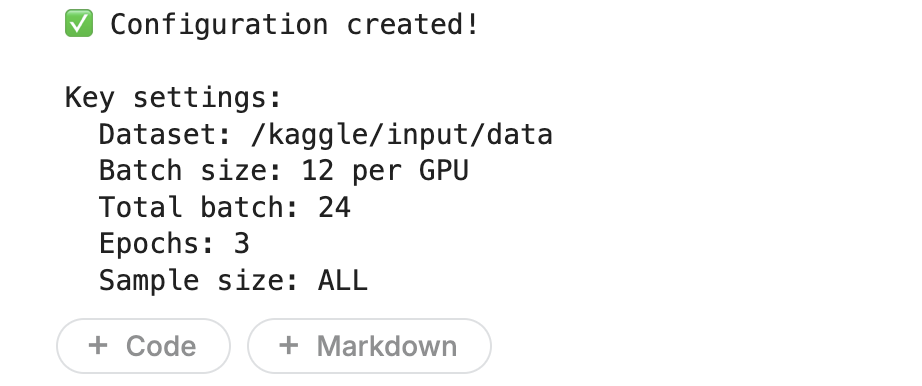
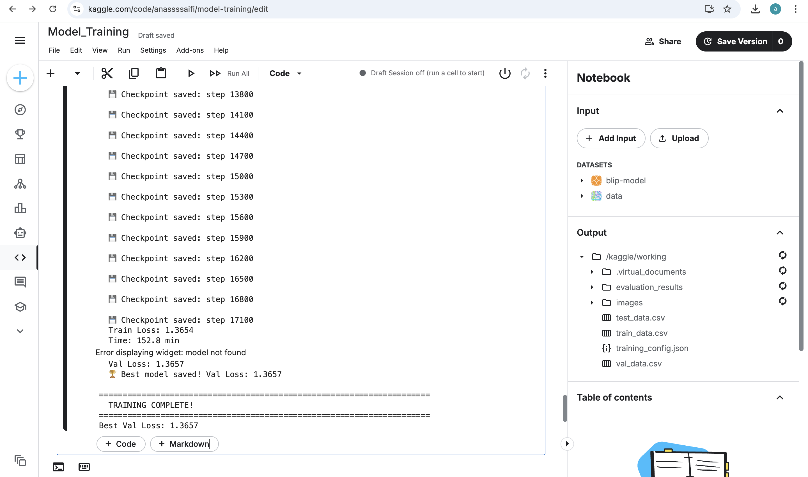

# ChestXpert-AI 🩺🤖  
**End-to-End Deep Learning Pipeline for Chest X-ray Disease Detection**

## 📌 Overview
ChestXpert-AI is a deep learning project focused on training and evaluating models for automated disease detection from chest X-ray images.  
This repository contains the **training pipeline**, including data preprocessing, model training, evaluation, and checkpointing.

---

## Training Configuration



---

## Training Progress



## ⚙️ Environment Setup

### 1️⃣ Create virtual environment
```bash
python -m venv venv
source venv/bin/activate   # Mac/Linux
venv\Scripts\activate      # Windows
pip install -r requirements.txt
'''

## 🚀 Training the Model
Using Python script
python src/train.py \
  --epochs 15 \
  --batch_size 32 \
  --learning_rate 1e-4

Using Jupyter Notebook

Open and run:

notebooks/Training.ipynb

💾 Checkpoints

Model checkpoints are saved automatically

Default path:

checkpoints/


Best model is saved based on validation loss

Example log:

Epoch 3/15 | Loss: 0.423 | Val Loss: 0.391
💾 Checkpoint saved

📈 Monitoring Training

Loss curves

Learning rate scheduling

NaN loss detection

Early stopping (optional)

